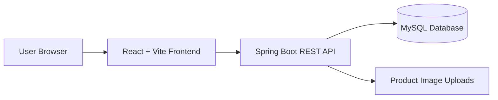

# ShopNest

ShopNest is a full-stack e-commerce project with a React frontend and a Spring Boot backend. It includes product browsing, category pages, cart and checkout flow, user order history, and an admin panel for managing products, orders, and users.

## Tech Stack

- Frontend: React, Vite, Redux Toolkit, React Router, Axios, Bootstrap Icons
- Backend: Spring Boot, Spring Security, Spring Data JPA, JWT authentication
- Database: MySQL

## Features

- User registration and login
- JWT-based authentication
- Browse products by category
- Product search and sorting
- Add to cart and remove from cart
- Checkout and order creation
- User order history
- Admin dashboard
- Admin product add, edit, and delete
- Admin order status management
- Image upload support for products

## Project Structure

```text
ShopNest/
├── shopnest-frontend/
└── shopnest-backend/
```

## Architecture



## Screenshots

Add screenshots of the home page, product list, cart, checkout, and admin dashboard in a `screenshots/` folder, then link them here.

## API Overview

| Area | Endpoint | Purpose |
| --- | --- | --- |
| Auth | `/api/auth/**` | Register and login users |
| Products | `/api/products/**` | Public product listing, detail, and search |
| Cart | `/api/cart/**` | Add, remove, and view cart items |
| Orders | `/api/orders/**` | Create orders and view order history |
| Payment | `/payment/**` | Mock payment creation and success flow |
| Admin | `/admin/**` | Manage products, users, and orders |

## Backend Setup

Move into the backend folder:

```powershell
cd shopnest-backend
```

Update `src/main/resources/application.properties` if your MySQL settings are different:

```properties
server.port=8080
spring.datasource.url=jdbc:mysql://localhost:3306/shopnest_db
spring.datasource.username=root
spring.datasource.password=root
```

Run the backend:

```powershell
.\mvnw.cmd spring-boot:run
```

Backend default URL:

```text
http://localhost:8080
```

## Frontend Setup

Move into the frontend folder:

```powershell
cd shopnest-frontend
```

Install dependencies:

```powershell
npm install
```

Start the frontend:

```powershell
npm run dev
```

Frontend default URL:

```text
http://localhost:5173
```

## Build Commands

Frontend production build:

```powershell
cd shopnest-frontend
npm run build
```

Backend tests:

```powershell
cd shopnest-backend
.\mvnw.cmd test
```

## Admin Access

Admin routes are protected by `ROLE_ADMIN`. To use the admin panel, log in with an account that has admin role in the database.

## Notes

- Product images are served by the backend from the `uploads/` folder.
- The backend uses JWT tokens stored by the frontend for authenticated requests.
- MySQL must be running before starting the backend.
- Do not commit generated folders such as `node_modules/`, `target/`, `.idea/`, or build output.

## Future Enhancements

- Add real payment gateway integration.
- Add product reviews and ratings.
- Add deployment configuration for frontend and backend hosting.
- Add automated frontend and backend test coverage.
- Add order invoice generation.

## Deployment

Deployment is not configured yet. Add the live frontend and backend URLs here after hosting the project.

## GitHub

Repository:

[https://github.com/Sumitsingh6923/ShopNest](https://github.com/Sumitsingh6923/ShopNest)
